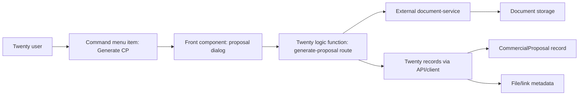

# ADR: Commercial Proposal Generation for Twenty

Date: 2026-07-12

## Status

Proposed. No application code is implemented in this phase.

## Verified Context

The target Twenty instance is `http://192.168.100.11:3000/`.

Verified facts:

- `GET /healthz` returns healthy status.
- `GET /client-config` returns `appVersion: v2.20.0`.
- `GET /client-config` returns `isWorkspaceSchemaDDLLocked: false`, so schema synchronization is not globally locked on the instance.
- npm registry reports `twenty-sdk@2.20.0` and `create-twenty-app@2.20.0` as `latest`.
- `twenty-sdk@2.20.0` package types were downloaded and inspected from npm.
- `create-twenty-app@2.20.0` starter template was downloaded and inspected from npm.

The neighboring local checkout at `C:\IT_Projects\twenty` is on branch `custom/russian-crm`, commit `bfc879d980`, with local workspace SDK `2.7.0`. It is useful as readable source context, but it is not the compatibility source of truth for this target instance.

## Decision

Build a Twenty App using `twenty-sdk@2.20.0` and `create-twenty-app@2.20.0`.

Use the app to add commercial proposal capabilities around standard `Company` and `Opportunity` records:

- store proposal metadata in custom objects and custom fields;
- add a user-facing launch point in `Company` and/or `Opportunity`;
- call an external `document-service` for DOCX/PDF generation;
- save the generated file reference in Twenty, preferably as metadata plus a Twenty file/link field depending on the final file API behavior;
- keep document rendering outside Twenty.

The preferred UI entry point is a `command menu item` scoped to `GLOBAL_OBJECT_CONTEXT` for `Company` and `Opportunity`, backed by a front component that collects options and calls a route-triggered logic function. A record-page front component can be added later if product UX requires a visible button/card directly on the record page.

## Rationale

Twenty Apps SDK `2.20.0` confirms support for:

- custom objects via `defineObject`;
- custom fields via `defineField`;
- relations via `FieldType.RELATION`, `RelationType.MANY_TO_ONE`, `RelationType.ONE_TO_MANY`;
- front components via `defineFrontComponent`;
- command menu items via `defineCommandMenuItem`;
- navigation items via `defineNavigationMenuItem`;
- page layouts/tabs via `definePageLayout` and `definePageLayoutTab`;
- logic functions via `defineLogicFunction`;
- roles and permissions via `defineApplicationRole`, `defineRole`, `definePermissionFlag`, object/field permissions, and system permission flags;
- file fields via `FieldType.FILES` and Files page layout widgets.

The SDK does not expose a separate `defineRecordAction` API in `2.20.0`. Therefore, the reliable action surface is command menu item plus front component. The SDK types include command menu context helpers such as `pageType`, `selectedRecords`, `objectMetadataItem`, `objectPermissions`, `targetObjectReadPermissions`, and `targetObjectWritePermissions`, which are suitable for conditional availability.

## Architecture

## Components

- Twenty App: owns metadata, UI surfaces, roles, and logic functions.
- Front component: displays proposal options and calls a route-triggered logic function.
- Logic function: validates context, reads source record data, calls `document-service`, writes generation status/result back to Twenty.
- Document service: produces DOCX/PDF and returns stable file metadata.
- Storage: either Twenty file storage if the app file API is sufficient, or external/S3-compatible storage with a URL persisted in Twenty.

## Consequences

- We avoid patching Twenty core.
- The app remains installable/upgradable through the Apps SDK.
- The visible "button in card" requirement is technically feasible through a command menu item today, and likely through a record page front component/widget if a persistent UI element is required.
- Exact file upload semantics must be validated during implementation against `twenty-sdk@2.20.0` CLI/API and the authenticated instance.

## Open Items

- Admin/API token for the target workspace is needed to validate actual install/sync permissions.
- The final storage decision depends on authenticated file upload testing.
- The final source object should be confirmed: Opportunity is the stronger primary anchor for CP generation; Company can offer a shortcut that asks the user to choose/create an Opportunity.
