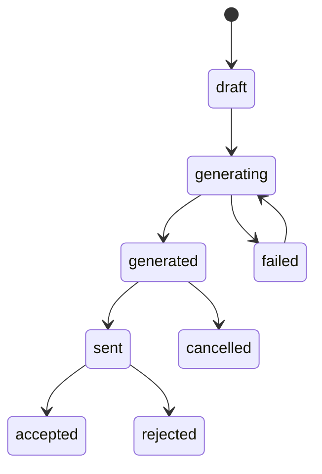

# Data Model

## Design Goals

- Keep standard Twenty `Company` and `Opportunity` as source records.
- Store generated commercial proposals as first-class custom records.
- Preserve generation history, status, template/version, output links, and errors.
- Avoid embedding large document payloads in regular fields.

## Standard Objects

Use Twenty standard objects:

- `Company`
- `Opportunity`

Recommended primary source: `Opportunity`.

Reason: a commercial proposal usually belongs to a concrete deal context: expected amount, stage, owner, point of contact, close date, products/services, and company.

Company entry point remains useful as a shortcut:

- generate proposal from Company only for generic proposals; or
- open dialog that requires selecting/creating an Opportunity.

## Custom Objects

### CommercialProposal

Stores one generated or draft proposal.

Fields:

| Field | Type | Required | Notes |
|---|---|---:|---|
| `name` | `TEXT` | yes | Human label, e.g. `CP-2026-00042 Mikoton`. |
| `number` | `TEXT` | yes | Unique proposal number. Add index/unique validation if supported by sync. |
| `status` | `SELECT` | yes | `draft`, `generating`, `generated`, `sent`, `accepted`, `rejected`, `failed`, `cancelled`. |
| `sourceType` | `SELECT` | yes | `company` or `opportunity`. |
| `templateCode` | `TEXT` | yes | Document-service template identifier. |
| `templateVersion` | `TEXT` | no | Exact renderer/template version. |
| `language` | `TEXT` | no | Example: `ru-RU`. |
| `currency` | `TEXT` | no | Example: `RUB`, `USD`, `EUR`. |
| `amount` | `CURRENCY` | no | Proposal total, if calculated. |
| `payloadSnapshot` | `RAW_JSON` | no | Request payload snapshot sent to document-service. |
| `resultMetadata` | `RAW_JSON` | no | Document-service response metadata. |
| `documentUrl` | `LINKS` | no | External URL if storage is outside Twenty. |
| `files` | `FILES` | no | Preferred if authenticated file upload works reliably. |
| `generatedAt` | `DATE_TIME` | no | Set when document generation succeeds. |
| `sentAt` | `DATE_TIME` | no | Optional sales workflow metadata. |
| `errorMessage` | `RICH_TEXT` | no | Failure details, sanitized for users. |
| `idempotencyKey` | `TEXT` | yes | Prevents duplicate document generation. |

Relations:

- `CommercialProposal` many-to-one `Company`.
- `CommercialProposal` many-to-one `Opportunity`.
- `Company` one-to-many `CommercialProposal`.
- `Opportunity` one-to-many `CommercialProposal`.

Rules:

- `Opportunity` relation is required for Opportunity-generated proposals.
- `Company` relation should be populated whenever possible, including from Opportunity.company.
- Preserve immutable `payloadSnapshot` for auditability.

### ProposalTemplate

Optional in phase 2. It can start as app variables or document-service configuration.

Fields:

| Field | Type | Required | Notes |
|---|---|---:|---|
| `name` | `TEXT` | yes | Display name. |
| `code` | `TEXT` | yes | Stable code passed to document-service. |
| `description` | `RICH_TEXT` | no | Internal help. |
| `isActive` | `BOOLEAN` | yes | Hide disabled templates from UI. |
| `defaultLanguage` | `TEXT` | no | Example: `ru-RU`. |
| `schema` | `RAW_JSON` | no | Input schema/options for UI. |

## Indexes

Recommended indexes:

- `CommercialProposal.number`
- `CommercialProposal.status`
- `CommercialProposal.generatedAt`
- `CommercialProposal.idempotencyKey`
- `CommercialProposal.company`
- `CommercialProposal.opportunity`
- `ProposalTemplate.code`

## Permissions

Default application role should allow:

- read `CommercialProposal`;
- create/update `CommercialProposal`;
- read `ProposalTemplate`;
- read source `Company` and `Opportunity`;
- upload/download file permissions if Twenty storage is used.

Do not grant destructive delete by default.

## Status Lifecycle

