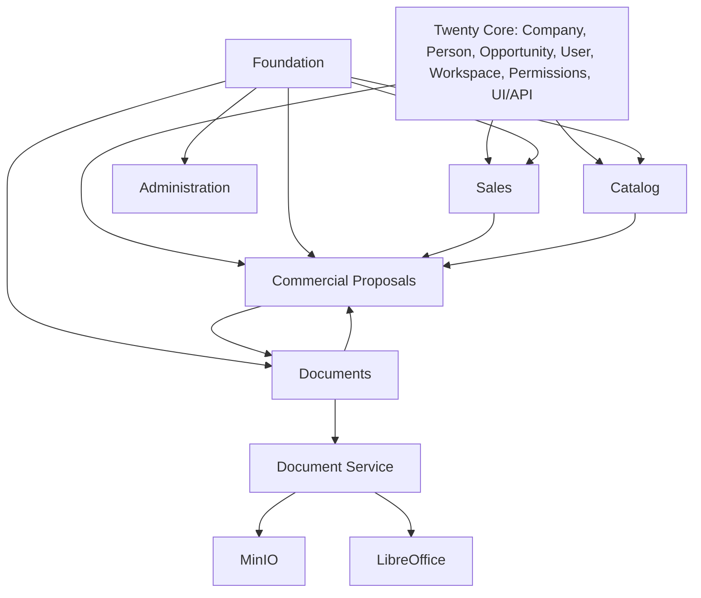

# Context Map

| Relationship | Owner | Direction / contract | Consistency | Failure behavior |
|---|---|---|---|---|
| Twenty -> Sales | Twenty | `OpportunityContextQuery` | Read current record | Safe not-found/forbidden |
| Catalog -> Proposals | Catalog | catalog query/selection DTO | Values copied into proposal snapshot | Selection rejected safely |
| Proposals -> Documents | Proposals | `DocumentGenerationPort` | Idempotent request + manifest | Proposal becomes FAILED or remains retryable |
| Documents -> worker | Documents | authenticated HTTP adapter | Request id and snapshot hash | Timeout/invalid response mapped to typed error |
| worker -> MinIO | Documents capability | private S3-compatible API | Immutable generation key | Readiness false / upload failure |
| worker -> LibreOffice | Documents capability | isolated subprocess | XLSX is source for PDF | Structured PDF export failure |
| Administration -> modules | Administration | registry/settings/health | Read-only diagnostics in Phase 6.0 | Fail closed on unsupported version |

Sales, Analytics and Delivery may grow later. Analytics and Delivery own no
metadata in Phase 6.0.
