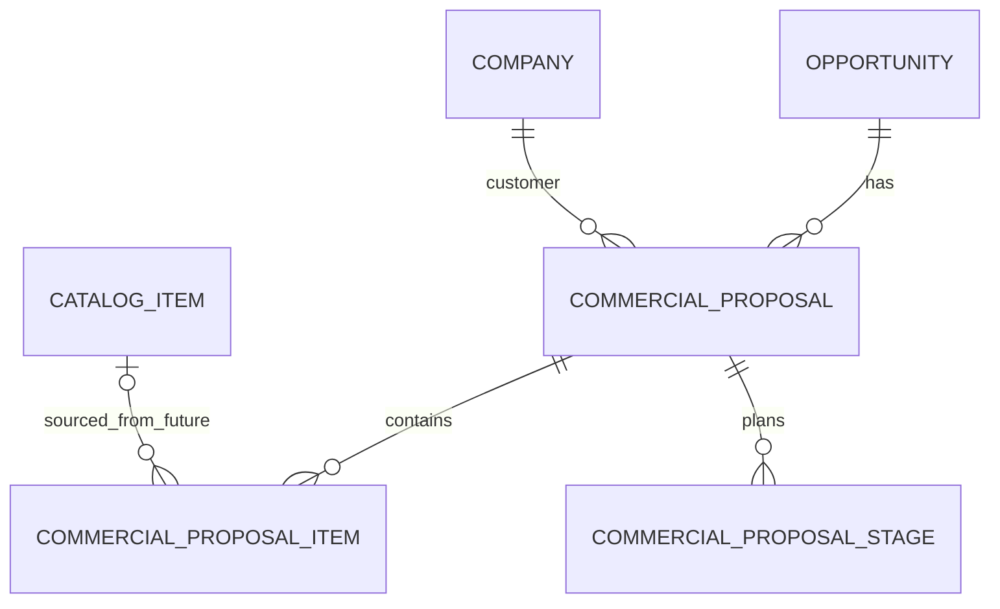

# Commercial Proposal Data Model v2

## 1. Context

The current app can create `CommercialProposal` drafts from `Opportunity` and generate XLSX/PDF files. The existing generation path is legacy schema `1.0`: it can synthesize one work item from the Opportunity name/amount when the proposal has no real line-item model.

Prompt 5.1 must introduce the aggregate data model without breaking legacy generation. Prompt 5.3 will introduce schema `2.0` generation from the aggregate.

This document is architecture only. It does not create metadata, universal identifiers, production code, templates, document-service changes, or deployment.

## 2. Problem

`Opportunity` is a sales forecast card:

```text
name = short opportunity title
amount = expected deal value
```

A real commercial proposal needs:

- proposal header and terms;
- multiple priced work items;
- delivery stages;
- immutable generation snapshot;
- generated file metadata.

The current single-object model mixes forecast amount, proposal total, work composition, draft input snapshot, and generation snapshot.

## 3. Current Model

### Opportunity

| Field | Type | Meaning | Current usage |
|---|---|---|---|
| `id` | UUID | Standard Twenty record id | Source record for draft |
| `name` | TEXT | Deal title | Used in draft title and legacy generation text |
| `amount.amountMicros` | Currency internals | Forecast / expected deal value | Converted to decimal |
| `amount.currencyCode` | Currency internals | Forecast currency | Copied to proposal currency |
| `company` | relation | Customer company | Copied to proposal relation |

### CommercialProposal

| Field | Type | Current meaning |
|---|---|---|
| `title` | TEXT | Draft/generated title |
| `number` | TEXT | Draft technical number or final `КП-### от DD.MM.YYYY` |
| `status` | SELECT | `DRAFT`, `GENERATING`, `GENERATED`, etc. |
| `sourceType` | SELECT | Currently `OPPORTUNITY` |
| `templateCode` / `templateVersion` | TEXT | Current generation template routing |
| `language` | TEXT | `ru-RU` |
| `payloadSnapshot` | RAW_JSON | Draft request, later generation snapshot |
| `resultMetadata` | RAW_JSON | Generated files metadata |
| `amount` | NUMBER | Legacy Opportunity amount snapshot |
| `currencyCode` | TEXT | Copied Opportunity currency |
| `opportunity` / `company` | RELATION | Source/customer links |
| `generatedAt` | DATE_TIME | Successful generation timestamp |
| `files` | FILES | Generated XLSX/PDF attached to record |
| `idempotencyKey` | TEXT | Draft create operation key |
| `lastError` | TEXT | Safe failure message |

Known limitations:

- No `CommercialProposalItem`.
- No `CommercialProposalStage`.
- `amount` is not always an aggregate total.
- Legacy generation can synthesize business content from Opportunity.
- Template v1 supports up to 5 work items and 1-3 stages.

## 4. Target Model

```text
Company
└── Opportunity
    └── CommercialProposal
        ├── CommercialProposalItem[]
        └── CommercialProposalStage[]
```

Future extension, not Prompt 5.1:

```text
CatalogItem
└── optional CommercialProposalItem.catalogItem
```

## 5. ER Diagram



`CATALOG_ITEM` is shown only for future compatibility. It is explicitly outside Prompt 5.1 metadata.

## 6. CommercialProposal

`CommercialProposal` is the aggregate root. It owns lifecycle, header fields, terms, generated artifacts, and child records.

| Field | FieldType | Metadata nullable | Default | User editable | Source of truth |
|---|---|---:|---|---:|---|
| `title` | TEXT | no | from Opportunity name | yes in DRAFT/FAILED | Editor |
| `number` | TEXT | no | `DRAFT-*`, final at generation | no | Numbering service |
| `version` | NUMBER | no | `1` | no | Business version of proposal |
| `contentModelVersion` | SELECT | no | `LEGACY_V1` | no | Stored content model |
| `editorRevision` | NUMBER | no | `1` | no | Editor concurrency marker |
| `lastEditorOperationId` | TEXT | yes | `null` | no | Replay-safe save marker |
| `status` | SELECT | no | `DRAFT` | no | Lifecycle |
| `sourceType` | SELECT | no | `OPPORTUNITY` | no | Source marker |
| `opportunity` | RELATION | no | source Opportunity | no | Source link |
| `company` | RELATION | yes | Opportunity company | yes in DRAFT/FAILED | Customer link |
| `contactName` | TEXT | yes | `null` | yes in DRAFT/FAILED | Editor |
| `contextAndGoal` | TEXT | yes | suggested text | yes in DRAFT/FAILED | Editor |
| `currencyCode` | TEXT | yes | Opportunity currency | yes in DRAFT/FAILED | Proposal currency |
| `validityDays` | NUMBER | no | `14` | yes in DRAFT/FAILED | Editor |
| `paymentTerms` | TEXT | yes | default text | yes in DRAFT/FAILED | Editor |
| `assumptions` | TEXT | yes | default text | yes in DRAFT/FAILED | Editor |
| `nextStep` | TEXT | yes | default text | yes in DRAFT/FAILED | Editor |
| `amount` | NUMBER(2) | keep current metadata | current value or `0` | no | Depends on `contentModelVersion` |
| `templateCode` | TEXT | no | current code | no initially | Template routing |
| `templateVersion` | TEXT | yes | `null` / generation version | no | Template routing |
| `language` | TEXT | no | `ru-RU` | yes in DRAFT/FAILED | Editor |
| `payloadSnapshot` | RAW_JSON | yes | `null` | no | Immutable generation snapshot |
| `resultMetadata` | RAW_JSON | yes | `null` | no | Generated artifact metadata |
| `generatedAt` | DATE_TIME | yes | `null` | no | Generation completion |
| `files` | FILES | yes | `null` | no | Generated files |
| `idempotencyKey` | TEXT | no | draft UUID | no | Draft create idempotency |
| `lastError` | TEXT | yes | `null` | no | Safe app error |

### `contentModelVersion`

Metadata contract:

```text
name: contentModelVersion
type: SELECT
isNullable: false
defaultValue: LEGACY_V1
editable by user: false
values: LEGACY_V1, AGGREGATE_V2
```

Semantics:

| Value | Meaning | Generation |
|---|---|---|
| `LEGACY_V1` | Proposal still uses old content model. `amount` may be an Opportunity snapshot. Items/stages may be absent. | Schema `1.0` allowed. |
| `AGGREGATE_V2` | Items are source of truth, stages are source of truth, `amount = SUM(lineAmount)`. | Schema `2.0` required after Prompt 5.3. |

Do not use `version` for this. `version` is the business version of the proposal; `contentModelVersion` is the stored content format.

## 7. CommercialProposalItem

Prompt 5.1 child object. It is a standalone snapshot object and must not include `catalogItem` yet.

| Field | FieldType | Metadata nullable | Default | Validation |
|---|---|---:|---|---|
| `commercialProposal` | RELATION | no | parent | required |
| `clientKey` | TEXT | no | UI UUID | UUID, user-hidden |
| `position` | NUMBER | no | server normalized | integer `>= 1` |
| `block` | TEXT | no | `Работы` | non-empty |
| `name` | TEXT | no | empty | required on save |
| `description` | TEXT | yes | `null` | optional |
| `quantity` | NUMBER | no | `1` | `> 0`, up to 4 decimals |
| `unit` | TEXT | no | `час` or `проект` | required |
| `unitPrice` | NUMBER | no | `0` | `>= 0`, 2 decimals |
| `discountPercent` | NUMBER | no | `0` | `0..100`, 2 decimals |
| `lineAmount` | NUMBER | no | calculated | server-calculated, 2 decimals |
| `currencyCode` | TEXT | no | parent currency | equals parent currency |

Logical uniqueness:

```text
(commercialProposalId, clientKey)
```

If Twenty metadata does not support a compound unique index, Prompt 5.1 must use a lookup-by-parent-and-clientKey fallback and document that it is replay-safe best effort, not a database-level uniqueness guarantee.

`lineAmount` is physically stored but never trusted from UI.

## 8. CommercialProposalStage

Prompt 5.1 child object.

| Field | FieldType | Metadata nullable | Default | Validation |
|---|---|---:|---|---|
| `commercialProposal` | RELATION | no | parent | required |
| `clientKey` | TEXT | no | UI UUID | UUID, user-hidden |
| `position` | NUMBER | no | server normalized | integer `>= 1` |
| `title` | TEXT | no | empty | required on save |
| `result` | TEXT | yes | `null` | required before schema `2.0` generation |
| `duration` | TEXT | yes | `null` | required before schema `2.0` generation |
| `description` | TEXT | yes | `null` | optional |

Prompt 5.1 editor save may persist incomplete stages in DRAFT/FAILED. Generation validation is stricter.

## 9. Field Matrix

| Entity | Field | FieldType | Metadata nullable | Index / uniqueness |
|---|---|---|---:|---|
| CommercialProposal | `contentModelVersion` | SELECT | no | optional filter |
| CommercialProposal | `editorRevision` | NUMBER | no | none |
| CommercialProposal | `lastEditorOperationId` | TEXT | yes | optional |
| CommercialProposal | `amount` | existing NUMBER | keep current | existing behavior |
| CommercialProposal | `currencyCode` | TEXT | yes | optional |
| CommercialProposalItem | `commercialProposal` | RELATION | no | parent lookup |
| CommercialProposalItem | `clientKey` | TEXT | no | logical unique with parent |
| CommercialProposalItem | `position` | NUMBER | no | parent sort |
| CommercialProposalStage | `commercialProposal` | RELATION | no | parent lookup |
| CommercialProposalStage | `clientKey` | TEXT | no | logical unique with parent |
| CommercialProposalStage | `position` | NUMBER | no | parent sort |

Exact nullability rules:

- `CommercialProposal.currencyCode` remains metadata-nullable. Application requires it when `AGGREGATE_V2` has items and before schema `2.0` generation.
- Do not make destructive nullability changes to existing fields without metadata plan.
- `CommercialProposalItem.description` is optional.
- `CommercialProposalStage.result` and `duration` are nullable metadata fields but required by schema `2.0` generation.

## 10. Lifecycle

| Status | Editable | Generation allowed |
|---|---:|---|
| `DRAFT` | yes | yes, subject to model-version guard |
| `FAILED` | yes | yes, subject to model-version guard |
| `GENERATING` | no | no |
| `GENERATED` | no | no |
| `SENT` | no | no |
| `ACCEPTED` | no | no |
| `REJECTED` | no | no |
| `CANCELLED` | no | no |

## 11. Amount Semantics

`amount` is state-dependent:

| `contentModelVersion` | Meaning of `amount` |
|---|---|
| `LEGACY_V1` | Legacy snapshot / historical value. It may equal Opportunity amount and does not have to match child rows. |
| `AGGREGATE_V2` | Materialized aggregate: `SUM(CommercialProposalItem.lineAmount)`. Server recalculates it on aggregate save. |

Do not state that `amount` is always an aggregate without qualifying it by `contentModelVersion`.

## 12. Source-of-Truth Rules

For `LEGACY_V1`:

- Current schema `1.0` rules remain valid.
- Items/stages may be absent.
- `amount` may be an Opportunity snapshot.

For `AGGREGATE_V2`:

- `CommercialProposalItem[]` is source of truth for work composition and pricing.
- `CommercialProposalStage[]` is source of truth for the plan.
- `CommercialProposal.amount` is derived from child line amounts.
- Generation must not use legacy synthetic content.

For all versions:

- `Opportunity.amount` is forecast only.
- `payloadSnapshot` is immutable generation input.
- `resultMetadata` is artifact metadata.

## 13. Money Calculation

Policy:

```text
quantity: up to 4 decimals
unitPrice: 2 decimals
discountPercent: 2 decimals
lineAmount = roundHalfUp(quantity * unitPrice * (1 - discountPercent / 100), 2)
amount = sum(rounded lineAmount)
```

Use a decimal helper or integer minor units. Do not use unchecked JavaScript floating-point arithmetic for authoritative totals.

## 14. Validation

### Editor save validation

- `title` required.
- Item `name` required.
- Item `quantity > 0`.
- Item `unit` required.
- Item `unitPrice >= 0`.
- Item `discountPercent` between `0` and `100`.
- Stage `title` required.
- Stage `result` and `duration` may be empty in DRAFT/FAILED.
- Zero items are allowed only while the record remains `LEGACY_V1`.
- Transition to `AGGREGATE_V2` requires at least one valid item.

### Generation validation schema `2.0`

- `contentModelVersion = AGGREGATE_V2`.
- At least one item.
- At least one complete stage if template v2 requires a plan.
- Stage `result` and `duration` filled.
- `currencyCode` filled.
- Total positive.
- Total matches line amounts.
- No invalid children.

## 15. Conversion Rule

A proposal remains `LEGACY_V1` until the first successful aggregate save with at least one valid item.

On conversion:

```text
contentModelVersion = AGGREGATE_V2
amount = SUM(server-calculated lineAmount)
editorRevision = editorRevision + 1
```

Conversion is irreversible.

Header-only save on a legacy DRAFT/FAILED:

- keeps `contentModelVersion = LEGACY_V1`;
- keeps legacy `amount` unchanged;
- keeps schema `1.0` generation available;
- does not count as conversion.

Starter item accepted and saved:

- converts to `AGGREGATE_V2`;
- recalculates `amount`;
- legacy amount stops being source of truth.

New records before Prompt 5.3:

- are created as `LEGACY_V1`;
- convert after aggregate save with items;
- cannot use aggregate generation until Prompt 5.3.

## 16. CatalogItem Boundary

`CommercialProposalItem.catalogItem` is not part of Prompt 5.1 metadata. Prompt 5.1 items are independent snapshots.

CatalogItem belongs to Prompt 5.4. When added later, the relation must be nullable and catalog values must be copied into item fields. Catalog changes must not mutate historical proposal items.

## 17. Risks

| Risk | Mitigation |
|---|---|
| Metadata upgrade affects existing fields | Add app-owned fields/objects only; plan before apply |
| Partial aggregate save creates duplicate children | `clientKey` + parent lookup/upsert + operation replay |
| Concurrency stronger than platform supports | Prompt 5.1 must spike CAS; otherwise document best-effort |
| `amount` semantics misunderstood | Always qualify by `contentModelVersion` |
| v2 data generated by v1 generator | Block `AGGREGATE_V2` generation until Prompt 5.3 |
| Catalog scope creep | Explicitly defer relation to Prompt 5.4 |

## 18. Closed Decisions

| Question | Recommendation |
|---|---|
| How distinguish legacy and aggregate? | `contentModelVersion` SELECT: `LEGACY_V1`, `AGGREGATE_V2`. |
| When conversion happens? | First successful aggregate save with at least one valid item. |
| Can v2 generate before Prompt 5.3? | No. Return `COMMERCIAL_PROPOSAL_GENERATION_MODEL_NOT_SUPPORTED`. |
| How avoid duplicate children? | `clientKey` UUID per child plus parent lookup/upsert. |
| How handle save retry? | `operationId` plus `lastEditorOperationId`; replay-safe convergent save. |
| Concurrency guarantee? | CAS if Twenty supports conditional update; otherwise honest best-effort. |
| Legacy amount? | Preserve until conversion; after conversion amount is aggregate. |
| Nullable currencyCode? | Metadata nullable; application requires conditionally. |
| Description required? | No. Item description optional. |
| CatalogItem relation? | Prompt 5.4 only. |

## 19. Recommended Decision

Adopt `CommercialProposal` as an aggregate root with `contentModelVersion`. Prompt 5.1 may save aggregate data and convert proposals to `AGGREGATE_V2`, but generation for `AGGREGATE_V2` must be blocked until Prompt 5.3 implements schema `2.0` and template v2.
