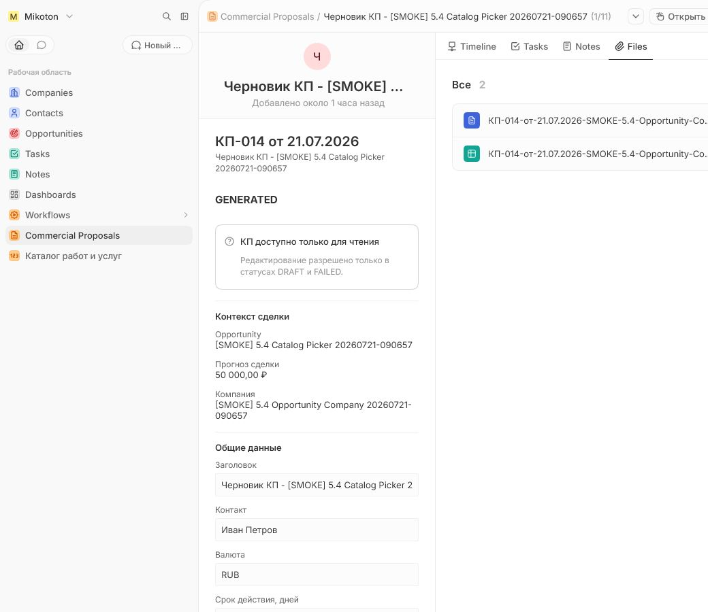

# Commercial Proposal Record Page UX Validation

## Build Under Test

- Target: `http://192.168.100.11:3000`
- Twenty: `v2.20.0`
- App version: `0.1.45`
- Source commit used for the release: `1cdbb7f8d063d47d243ccc307688459ab2aba0f9`
- Date: `2026-07-21`
- Tarball: `release-artifacts/mikoton-commercial-proposals-0.1.45.tgz`
- Tarball SHA-256: `143b439c657a1175a455226a500b7d0af5c2f3644bbadcac4aba8856bbe1f605`

## Automated Validation

| Check | Result | Evidence |
|---|---|---|
| Lint | Passed | WSL production build, 0 errors |
| Typecheck | Passed | WSL `corepack yarn typecheck` |
| Unit tests | Passed | 116 tests |
| Tarball build and validation | Passed | Linux-compatible `0.1.45` tarball; manifest paths and bundled files validated |
| Target integration smoke | Passed | WSL `corepack yarn test:target-smoke`: 1 file, 8 tests |
| Record page metadata | Passed | Home canvas front component plus Timeline, Tasks, Notes and Files; no generic `FIELDS` widget |
| Default list navigation | Passed | `ViewOpenRecordIn.RECORD_PAGE` |
| New draft defaults | Passed | `AGGREGATE_V2`, `amount = 0`, `number = Черновик`, no synthetic item |
| Repeated metadata plan | Passed | `No changes. Twenty metadata matches your manifest.` after `0.1.45` install |

## Deployment

Private publish and install through `deploy.bat` completed successfully. The
release manifest records `installAttempted: true` and `installSucceeded: true`.
No uninstall or destructive business-data cleanup was performed.

Twenty `v2.20.0` did not update an existing app-owned page tab from
`VERTICAL_LIST` to `CANVAS`, and its plan incorrectly reported no change for
that property. The fix recreated only the app-owned Home tab and widget with new
universal identifiers. The inspected plan contained exactly those two additions
and two app-owned removals. The final repeated plan is empty.

## Target Browser Smoke

The installed central record page was opened for proposal
`c42fe098-1e1f-4d1e-a0cb-a2bda4ca7bff`.

| Check | Result | Evidence |
|---|---|---|
| Central card | Passed | Editor rendered on the CommercialProposal record route, not in the command side panel |
| Business-only surface | Passed | Header, deal context, items, stages, terms and total are visible; JSON, idempotency and revision fields are absent |
| Aggregate editor | Passed | One item and one complete stage were saved; canonical total is `50,000 RUB` |
| Final number | Passed | `КП-014 от 21.07.2026` |
| Generation validation | Passed after fix | First attempt safely became `FAILED` because `customer.contactName` was missing; UI readiness now requires a contact before enabling generation |
| Retry | Passed | Contact `Иван Петров` was saved and retry completed as `GENERATED` |
| Generated at | Passed | `2026-07-21T12:23:43.000Z` |
| Native Files | Passed | Files tab shows exactly two attachments: XLSX and PDF |
| Read-only historical state | Passed | GENERATED proposal renders disabled controls and cannot be edited |

Generated artifacts:

| Format | File | Size | SHA-256 |
|---|---|---:|---|
| XLSX | `КП-014-от-21.07.2026-SMOKE-5.4-Opportunity-Company-20260721-090657.xlsx` | 8,965 bytes | `4fc00c668812fa6c8399c794f4b73092e730bbf3637a50d64034d97150da21d6` |
| PDF | `КП-014-от-21.07.2026-SMOKE-5.4-Opportunity-Company-20260721-090657.pdf` | 82,991 bytes | `364cd1cefc151ef7227583bf0e6187cc55be19caf28abe7ce15d60df8aeb01ad` |

The stored result metadata contains Twenty file ids for both artifacts. Signed
download URLs and credentials are intentionally omitted from this report.

## Notes

- The target smoke also reconfirmed legacy schema `1.0` generation and aggregate
  save replay behavior without duplicate child identities.
- Native Timeline may show technical field changes as audit events. These fields
  remain absent from the normal Home business card.
- A separate restricted-user denial smoke was not executed in this UX run.
